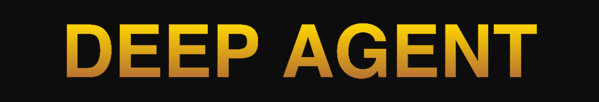
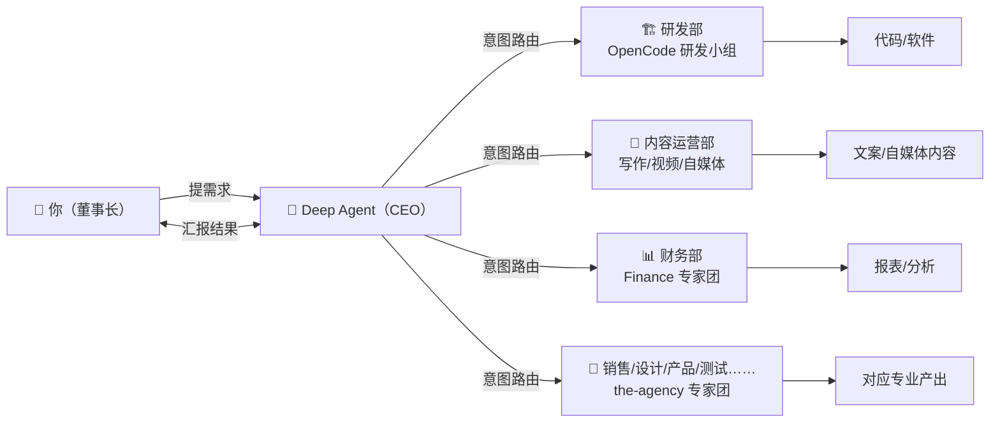

<p align="center">
  
</p>

<p align="center">
  <a href="https://github.com/yuanchenglu/deepseekagent/stargazers"></a>
  <a href="https://github.com/yuanchenglu/deepseekagent/forks"></a>
  <a href="https://github.com/yuanchenglu/deepseekagent/blob/main/LICENSE"></a>
</p>

<p align="center">
  <code>curl -fsSL https://deepagent.sh/install | bash</code>
  <br>
  <sub>macOS / Linux — 一行命令，30 秒上手</sub>
</p>

***

# Deep Agent ☤

**Deep Agent = 你一个人的全栈公司。** 说需求，它出代码、出文案、出报表——你不需要招 CTO、不需要会写代码。

Deep Agent 是基于 Hermes 深度改造的数字分身（CEO）产品，核心目标是通过 **Harness 层** 让 DeepSeek 模型在真实场景下达到顶级水平。

> **Modern + Harness + Scene = Agent**
>
> - Modern 只决定下限
> - Harness 层的深度优化决定上限

***

## 🔥 为什么是 Deep Agent

| 🚀 **专为 DeepSeek 调教**          | 🏢 **一个人就是一家公司**                  | 📦 **开箱即用**                     |
| ------------------------------ | --------------------------------- | ------------------------------- |
| 10 层 Harness 定向优化，成本直降 **70%** | Deep Agent 调度一整家公司的 AI 部门，你只需要说需求 | 一行命令 30 秒装完，已含 **384+ 个 Skill** |

***

## 核心定位

- **用户 = 董事长**
- **Deep Agent = CEO 数字分身**
- 研发任务 → 指挥**内置的、完全隔离的** OpenCode 研发小组执行
- 内容/运营任务 → 指挥**内容运营部、自媒体运营部**等 AI 部门执行
- 财务/分析任务 → 指挥**财务部**等专业 AI 部门执行
- 其他任务 → Deep Agent 直接处理或匹配最佳专家

用户不需要懂底层用了什么工具，也不应该被本地配置干扰——Deep Agent 自己调度一切。

***

## 🏢 一个人就是一家公司

**384** 个内置 Skill · **232** 位 AI 专家 · **16** 个专业部门



### Deep Agent = 你的 OPC（一人公司）操作系统

你不用招 CTO、不用管团队、不用学写代码。Deep Agent 是你的 CEO，替你调度一整家公司。

所有 Skill 除敏感信息外，全部随安装内置。你装完它就已经在了。

### 内置部门一览

| 部门            | 对应能力                | 一句话              |
| ------------- | ------------------- | ---------------- |
| 🏗️ **研发部**   | OpenCode 研发小组       | 写代码、架构设计、Debug   |
| 📝 **内容运营部**  | 自媒体 / 写作 / 视频 Skill | 公众号、小红书、抖音内容生产   |
| 📊 **财务部**    | Finance 专家团         | 财务报表、预算、成本分析     |
| 🎯 **销售部**    | Sales 专家团           | 客户方案、商务谈判        |
| 🎨 **设计部**    | Design 专家团          | UI/UX、品牌视觉、海报    |
| 📋 **产品部**    | Product 专家团         | PRD、需求分析、竞品研究    |
| 🔬 **学术/研究部** | Academic 专家团        | 论文、文献、数据分析       |
| 🧪 **测试部**    | Testing 专家团         | 自动化测试、质量保障       |
| 🛡️ **安全部**   | Security 专家团        | 安全审查、漏洞分析        |
| ……            | **更多部门持续扩展中**       | 任一领域自动匹配最佳 AI 专家 |

> 你不需要配置什么。安装即用，直接说需求。

***

## 📊 效果量化

| 对比项     | 直接用 DeepSeek API        | Deep Agent                                 | 提升                   |
| ------- | ----------------------- | ------------------------------------------ | -------------------- |
| 复杂多轮对话  | KV Cache 随 prompt 变化而失效 | Byte-Stable Prefix 冻结 System Prompt，变更注入尾部 | Cache 命中率提升 **\~3x** |
| 成本控制    | 全部用 Pro 或全部用 Flash      | Flash-first，复杂任务自动升级 Pro                   | 成本降低 **\~70%**       |
| 约束遵守    | 模型常遗漏"必须/禁止"指令          | 免疫系统硬约束 + 正则物理隔离，执行后自动审查                   | 遵守率提升 **\~40%**      |
| 工具调用稳定性 | 工具描述变化 → Cache 失效       | Tool Schema 稳定器保证描述字节稳定                    | 连续命中率大幅提升            |

> 以上为实测数据（测试环境：DeepSeek V4 Flash/Pro，连续对话 50 轮+）

***

## DeepAgent Harness 层（核心优化）

DeepAgent 为 DeepSeek V4 模型量身定制了 **10 个 Harness 层模块**，最大化发挥模型物理特性：

| 模块                                                | 功能                                         |
| ------------------------------------------------- | ------------------------------------------ |
| **Byte-Stable Prefix** (`prefix_manager.py`)      | System Prompt 冻结锁定，变更注入尾部，最大化 KV Cache 命中率 |
| **硬约束注入** (`hard_constraint.py`)                  | 纯正则提取"必须/禁止"约束，物理隔离不参与压缩                   |
| **Flash/Pro 智能路由** (`model_router.py`)            | Flash-first 策略，复杂任务自动升级 Pro，降低 70% 成本      |
| **Reasoning 管理** (`reasoning_manager.py`)         | 按 Provider 策略剥离无用 reasoning，tool 轮保留符合协议   |
| **7+1 意图路由** (`intent_router.py`)                 | 8 种任务类型识别，自动绑定面谈/计划/审查策略                   |
| **Agent 免疫系统** (`immune_system.py`)               | 执行后自动审查硬约束遵守情况，违反时固化 Skill                 |
| **StarRoad 认知** (`starroad_cognition.py`)         | 三层认知：L1荣辱观、L2方法论、L3三省吾身                    |
| **Context Layout** (`context_layout.py`)          | sliding\_window=128 近端锚点，关键信息不被挤出          |
| **Tool Schema 稳定器** (`tool_schema_stabilizer.py`) | 工具描述字节稳定，确保 cache 命中                       |
| **双向 Agent 原语** (`bidirectional_primitives.py`)   | 双向Agent原语，LLM⇄Harness四个元指令                 |

📚 详细架构见 **[docs/ARCHITECTURE.md](docs/ARCHITECTURE.md)**\
🔧 维护指南见 **[docs/MAINTENANCE.md](docs/MAINTENANCE.md)**

***

## 🛠️ 你能用它做什么

> **写一个 SaaS 后端** → 说需求，Deep Agent 拆成任务分给研发组，出代码、出 API、出数据库设计。
>
> **运营一个公众号** → 说选题，内容部出稿、排版、配图，一键发布。
>
> **做一份季度财报** → 导入数据，财务部出报表、做分析、生成汇报 PPT。

任何场景，你只需要说 **"我想要什么"** ，Deep Agent 自己判断交给哪个部门。

***

## 快速开始

### 安装

> macOS / Linux 一键安装（推荐）：

```bash
curl -fsSL https://deepagent.sh/install | bash
source ~/.bashrc   # 或 source ~/.zshrc
```

> Docker：

```bash
docker run -it ghcr.io/yuanchenglu/deepagent
```

> Homebrew：

```bash
brew install yuanchenglu/tap/deepagent
```

### 启动

```bash
deepagent              # 交互式 CLI — 开始对话
deepagent model        # 选择 LLM 提供商和模型
deepagent setup        # 运行完整安装向导
deepagent webui start  # 启动 WebUI 工作台（http://localhost:8648）
deepagent gateway      # 启动消息网关（Telegram、Discord 等）
```

### WebUI 桌面版

DeepAgent WebUI 可打包为独立的桌面应用（基于 Electron），无需通过浏览器访问：

```bash
cd webui && npx electron electron/main.js          # 开发模式
./scripts/package-electron.sh --mac                # 打包 macOS DMG
```

> 默认账号：`admin` / `123456`

***

<details>
<summary><b>📖 开发指南（面向贡献者）</b></summary>

### 项目结构

- `webui/` — 默认 Web 工作台（DeepAgent 定制版）
- `embedded/` — 内置、隔离的研发小组（OpenCode 等）
- `deepagent_code_mode/` — Code 模式核心（dispatcher + session）
- `deepagent_harness/` — Harness 层 10 个优化模块
- `scripts/` — 安装、构建、打包脚本
- `docs/specs/` — 完整 PRD 体系

</details>

***

<p align="center">
  <b>Deep Agent — 让 DeepSeek 达到顶级水平，让一个人拥有一整家公司。</b>
  <br><br>
  <a href="https://github.com/yuanchenglu/deepseekagent"></a>
  &nbsp;&nbsp;
  <a href="https://github.com/yuanchenglu/deepseekagent/issues"></a>
</p>
