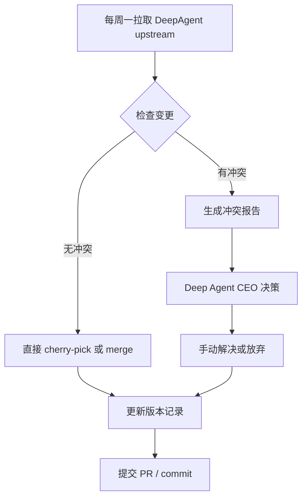

# 01 - 上游同步与品牌统一（Upstream Sync and Branding）

**版本**：v0.1  
**日期**：2026-07-01  
**状态**：草案  
**关联 Overview**：MVP-PRD-Overview.md

---

## 1. 问题背景

Deep Agent 当前基于较老版本的 DeepAgent 进行 fork，已进行了大量修改（包括 Harness 层优化、配置体系、技能系统等）。直接升级到最新 DeepAgent 会产生大量冲突，且品牌残留问题严重影响产品定位。

**核心痛点**：
- 每周与 DeepAgent 上游同步的需求 vs. 大量本地修改导致的冲突管理难度
- 品牌替换不彻底，严重影响用户认知和产品专业性

---

## 2. 目标

1. 建立可持续的**每周上游同步机制**（非全量强制同步，冲突可控）
2. 完成彻底的**品牌统一**（大小写敏感替换）
3. 所有修改最小化、可回滚、可审计

---

## 3. 上游同步机制设计

### 3.1 同步策略原则

- **默认每周同步一次**（建议固定在周一或周二）
- **非全量同步**：只同步「无冲突或低风险」的变更
- **冲突处理**：由 CEO（Deep Agent）决策取舍，而非自动合并
- **版本锁定**：维护一个 `deepagent-upstream-version.txt`，记录当前跟踪的 DeepAgent commit

### 3.2 推荐工作流

### 3.3 工具与脚本建议

- 在 `scripts/` 下新增：
  - `sync-deepagent-upstream.sh`：自动化拉取 + 冲突检测
  - `generate-conflict-report.py`：生成易读的冲突清单

---

## 4. 品牌统一计划

### 4.1 替换规则（大小写敏感）

| 原字符串 | 替换为 | 说明 |
|----------|--------|------|
| `deepagent` | `deepagent` | 小写场景（命令、变量、文件名等） |
| `DeepAgent` | `DeepAgent` | 首字母大写场景（产品名、UI 文案） |
| `HERMES` | `DEEPAGENT` | 全大写场景（环境变量、常量等，需谨慎） |

### 4.2 替换范围（优先级排序）

**高优先级（必须在 MVP 阶段完成）**：
- TUI 启动文案、setup 流程提示
- CLI 帮助信息、错误提示
- `website/` 下的 index.html 及相关文案
- 关键 Python 文件中的类名、常量（`deepagent_constants.py` 等）
- 文档中的所有 DeepAgent 引用

**中优先级**：
- 文件命名（`deepagent_*.py` → `deepagent_*.py`）
- 目录名（`deepagent_cli/` → `deepagent_cli/`）
- 日志、错误堆栈中的字符串

**低优先级（可延后）**：
- Git history 中的历史 commit（不修改）
- 第三方依赖中的引用

### 4.3 实施建议

1. 先使用 `grep` + `rg` 全量扫描当前代码库，生成替换清单
2. 编写自动化替换脚本（支持 dry-run 模式）
3. 替换后执行全量测试 + 手动验证关键路径
4. 提交时使用双语 commit message

---

## 5. 风险与缓解

| 风险 | 影响 | 缓解措施 |
|------|------|----------|
| 品牌替换导致运行时错误 | 高 | 必须 dry-run + 自动化测试覆盖 |
| 上游同步引入破坏性变更 | 高 | 建立 conflict report + CEO 决策机制 |
| 文件重命名影响 import | 中 | 使用 IDE 重构 + 全局搜索验证 |
| 文档中残留 DeepAgent | 低 | 建立 PR 检查 checklist |

---

## 6. 验收标准

- [ ] 每周同步脚本可稳定运行
- [ ] 代码库中不再出现 `DeepAgent` / `deepagent`（除历史 commit 和第三方依赖）
- [ ] TUI、setup、website 全部显示为 Deep Agent
- [ ] 替换后功能正常，无回归

---

## 7. 技术债务记录：深层品牌替换（已暂停）

### 问题
代码库中仍在大量使用 Hermes 原始品牌名称（模块名、类名、文件名、环境变量）。

### 替换清单（待完成）

| 替换目标 | 影响范围 | 风险 | 优先级 |
|---------|---------|------|--------|
| `hermes_cli/` 目录→`deepagent_cli/` | 255 个 import 文件 | 🔴 极高 | 低 |
| `hermes_state.py`→`deepagent_state.py` | 24 文件 import | 🔴 高 | 低 |
| `hermes_logging.py`→`deepagent_logging.py` | 7 文件 import | 🔴 高 | 低 |
| `hermes_time.py`→`deepagent_time.py` | 4 文件 import | 🔴 高 | 低 |
| `hermes_constants.py`→`deepagent_constants.py` | 118 文件 import | 🔴 高 | 低 |
| `HermesCLI` 类→`DeepAgentCLI` | 41 文件 | ⚡ 中 | 低 |
| `HERMES_HOME` → `DEEPAGENT_HOME`（保留 fallback）| 155 文件 | ⚡ 中 | 中 |
| `get_hermes_home()` → `get_deepagent_home()` | 119 文件 | ✅ 已有别名 | 已完成 |
| `HermesTokenStorage` → `DeepAgentTokenStorage` | 2 文件 | ✅ 低 | 低 |
| `HermesIndexSource` → `DeepAgentIndexSource` | 1 文件 | ✅ 低 | 低 |

### 决策
当前暂停深层品牌替换，原因：
1. 模块改名涉及 255+ 个 import，需要全量依赖分析
2. `hermes_cli/` 改名会影响插件、gateway、tools 等所有模块
3. 推荐在正式发版前集中处理，使用 opencode + oh-my-openagent/Prometheus 规划，设置 120 分钟超时

### 执行策略（未来）
1. 用 Prometheus 出计划（opencode run -f prometheus-prompt --timeout 120min）
2. 按低风险→高风险顺序分批执行
3. 每批执行后全量编译 + pytest 验证
4. 最后清理兼容别名

---

**备注**：本子文档为草案，重点在于机制设计而非立即执行代码修改。所有实际修改需在 PRD review 通过后进行。