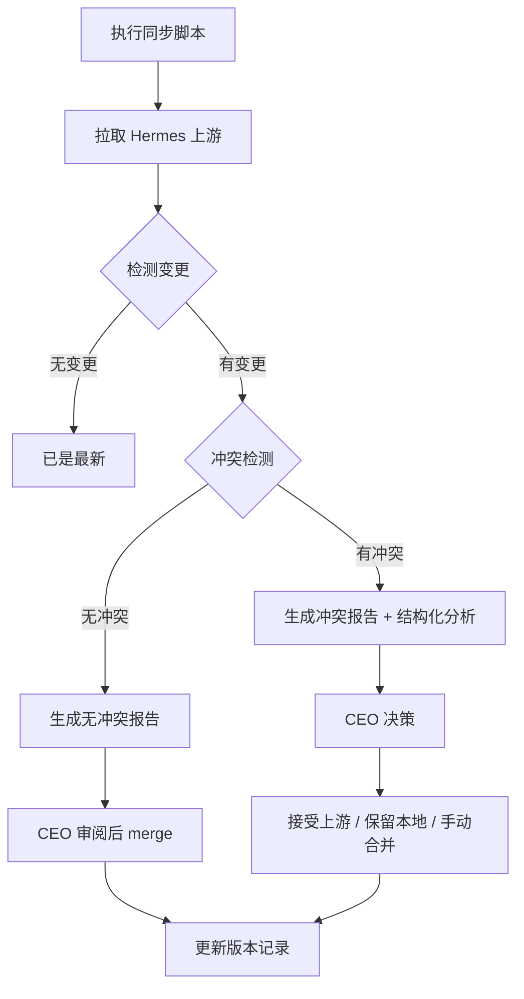

# 🔄 Hermes 上游同步机制

## 概述

DeepAgent 是基于 [NousResearch/hermes-agent](https://github.com/NousResearch/hermes-agent) 的 fork，需要建立可持续的每周上游同步机制。

**核心原则**：
- ✅ **检测不强制** — 自动检测上游变更和冲突，但**不自动 merge**
- ✅ **CEO 决策** — 冲突处理由项目负责人决定（接受上游 / 保留本地 / 手动合并）
- ✅ **版本可追溯** — 每个同步周期都有记录和冲突报告
- ✅ **安全预览** — 支持 `--dry-run` 模式，零风险预览变更

## 工作流程



## 文件结构

| 文件 | 说明 |
|------|------|
| `../hermes-upstream-version.txt` | **项目根目录** — 记录当前跟踪的上游版本 |
| `../scripts/sync-hermes-upstream.sh` | **主同步脚本** — 拉取、检测、报告 |
| `../scripts/generate-conflict-report.py` | **辅助脚本** — 冲突结构化分析 |
| `conflict-YYYYMMDD.md` | **历史冲突报告** — 按日期命名 |
| `README.md` | **本文档** — 同步机制说明 |

## 使用方法

### 查看当前版本状态
```bash
bash scripts/sync-hermes-upstream.sh --status
```

### 安全预览上游变更（不修改任何文件）
```bash
bash scripts/sync-hermes-upstream.sh --dry-run
```

### 执行标准同步检测
```bash
bash scripts/sync-hermes-upstream.sh
```

## CEO 决策指南

当检测到冲突时，请按以下步骤处理：

1. **查看冲突报告**：打开 `docs/sync/conflict-YYYYMMDD.md`
2. **分析优先级**：
   - 🔴 **高优先级**：核心功能文件（CLI、Agent、Harness 等），需谨慎决策
   - 🟡 **中优先级**：常规功能文件，可手动合并
   - 🟢 **低优先级**：文档、配置文件，可快速合并
3. **做出决策**：
   - **接受上游**：`git checkout --theirs <file>` — 上游修复了 bug
   - **保留本地**：`git checkout --ours <file>` — DeepAgent 特有功能
   - **手动合并**：编辑冲突标记 — 双方都有有价值修改
   - **跳过此版本**：`git merge --abort` — 上游变更与方向不一致
4. **提交并更新**：合并完成后更新 `hermes-upstream-version.txt`

## 同步周期

- **默认频率**：每周一次（建议周一或周二）
- **流程**：运行脚本 → 查看报告 → CEO 决策 → 合并 → 更新版本
